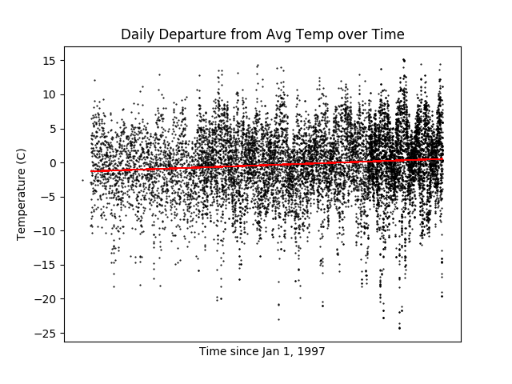
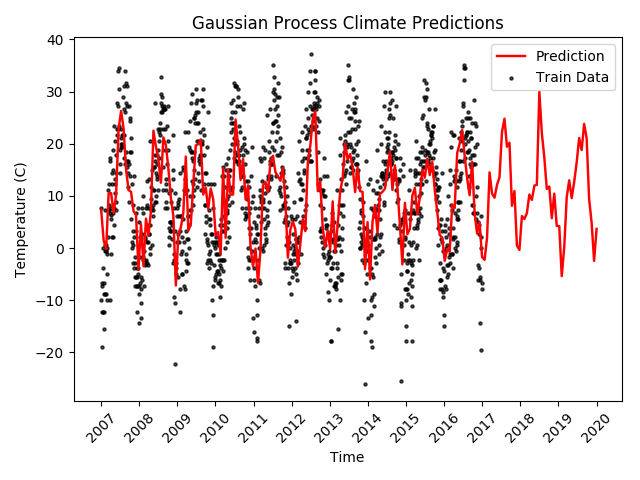

## Mile High Climate Change: Analyzing and Modeling Climate Change in Denver

#### Problem

While climate change is a popular topic of discussion, public opinion is not often supported with accurate data. My goal for this project is to analyze the past 40 years of Denver climate data to see if there has been a statistically significant change in the climate and if so, to model and predict the future trend.

Climate models have continuously evolved throughout the recent years, implementing new features as their correlations are discovered. The current Earth System Models (ESMs) have improved upon the previous atmospheric and oceanographic models by including biochemical cycles as a predictor. While tremendous strides have been made in realizing these hard-to-detect trends, there are still more to be discovered. My hope is to utilize supervised machine learning models to predict climate trends, the benefit being that these models may be able to predict subtle trends without needing to know the source.

#### Data and Methods

My data is being taken from [National Centers for Environmental Information](https://www.ncdc.noaa.gov/). I have accessed and downloaded the land-based local climate data from DIA since Jan. 1, 1997 along with the data from Buckley AFB since Jan. 1, 1977. This data can be downloaded locally as a CSV and I've gone ahead and stored the raw data on an AWS S3 bucket.

No feature is complete for every row, so I began by cleaning the data to ensure I could utilize any available features in my model. There were many features with mixed data-types which needed to be translated into continuous data. One instance of this is the precipitation column which allows “T” to be entered for trace precipitation. In this specific instance, I replaced the "trace" values with 0. I went through each column where intuitive imputation was relevant.

For the rest of the features, I employed a k-Nearest Neighbors regression model to fill in missing values. This learned trends in the complete columns to go through each remaining column and predict the missing data.

#### A/B Testing

I initially conducted a simple hypothesis test on the data to reject the null hypothesis that the climate has not changed significantly during this time period. I split the data into two 20-year periods (1977-1997 from Buckley and 1997-2017 from DIA). When analyzing hourly dry-bulb temperatures this split resulted in a p-value of 1.72e-56, allowing me to reject the null and conclude that the temperature has in fact changed significantly.

For ease of computation I decided to focus on the DIA data since 1997 for the rest of my project. Below I plotted the daily departure from the average temperature over time and ran it through a linear regression. There is an obvious increasing tend in the data and I will include this in the model along with the seasonal periodicity.

#### Gaussian Process Regression

To model this climate data, I chose to implement a [Gaussian Process Regressor](http://scikit-learn.org/stable/modules/generated/sklearn.gaussian_process.GaussianProcessRegressor.html#sklearn.gaussian_process.GaussianProcessRegressor). This allows me to return probabilities along with my predictions. For each predicted point, I have a confidence interval to illustrate the error in the prediction which is especially useful for time series predictions. Much of the variation in my model is based on modeling [CO2 Concentrations at Mauna Loa](http://scikit-learn.org/stable/auto_examples/gaussian_process/plot_gpr_co2.html).

##### Kernels
I chose to combine a few kernels to fully account for the signal in the data. A squared exponential kernel was chosen to model the long-term upward trend of climate data while a sinusoidal kernel was used to account for the seasonality of the data.

Squared Exponential:

Sinusoidal:

#### Results

While the large dataset posed difficulties on my local machine, I was able to train and build my model locally by subsetting the data to every 100th observation. Once my hyperparameters were tuned for the best results I was then able to conduct the final model run on an AWS GPU instance on the full dataset (after dealing with theano's memory allocation issues).

I scored my model against the known values for the years 2015 and 2016. The best model scored an R^2 value of 0.451.

The climate data is extremely noisy and the visualization of my model reflected this, displaying major jumps in the predictions along with the expected seasonality. In order to account for this, I further tuned the alpha parameter in my regressor. This was able to smooth out the graph, however I believe there can still be some major benefits to utilizing the noisy model as it better matches the real data. Smoothing out the model slightly decreased my R^2, confirming this assumption. Below are two graphs comparing both models when predicting out to 2020.

| Climate Prediction to 2020  | Prediction When Accounting for Noise |
| ------------- | ------------- |
|   |   |

One major reason for choosing a Gaussian Process Recressor is that each prediction is accompanied by a distribution and standard deviation for that point. This allows one to plot a confidence interval around the predictions. Seeing as I have a very populated training set, this interval is smaller than I had expected and I would like to further investigate the accuracy of this.

| Noisy Prediction with a 95% Confidence Interval | Prediction When Accounting for Noise |
| ------------- | ------------- |
|   |   |

One can see that smoothing out the noise actually increases the error of the estimate, another reason to keep the noise in the model. One would mainly want to use the smoothed model to predict much further into the future as it displays more long-term trends.

The biggest issue with time series data is your feature limitation. Using 1995-2015 as my training set and testing again on the years 2015 and 2016, I achieved an R^2 score of 0.9985, but predicting into the future, the only feature I can use is the date. It would be interesting to use my model to predict on each of my features individually and then utilize this predicted matrix to estimate future temperatures.

#### Further Exploration

The first change will be using only data from Buckley AFB to avoid constraining my training set to the 1995 opening date of DIA. This will allow me to look much further back into the local climate to detect larger trends and hopefully make more accurate predictions. Similar to the DIA data, this new data will have to be cleaned before analysis can take place.

One frustration I encountered during this project was the model's inability to predict extremes in the seasonality. A large concern with climate change in the increase in frequency of extreme weather events. I would be interested in conducting some feature engineering to classify each observation (or per day) as an extreme event or not, and quantify exactly how far from the expectation it is. This analysis could be done on more than just temperature. I could include wind speeds and precipitation and attempt to overlay the data with known storm systems moving through the region.
